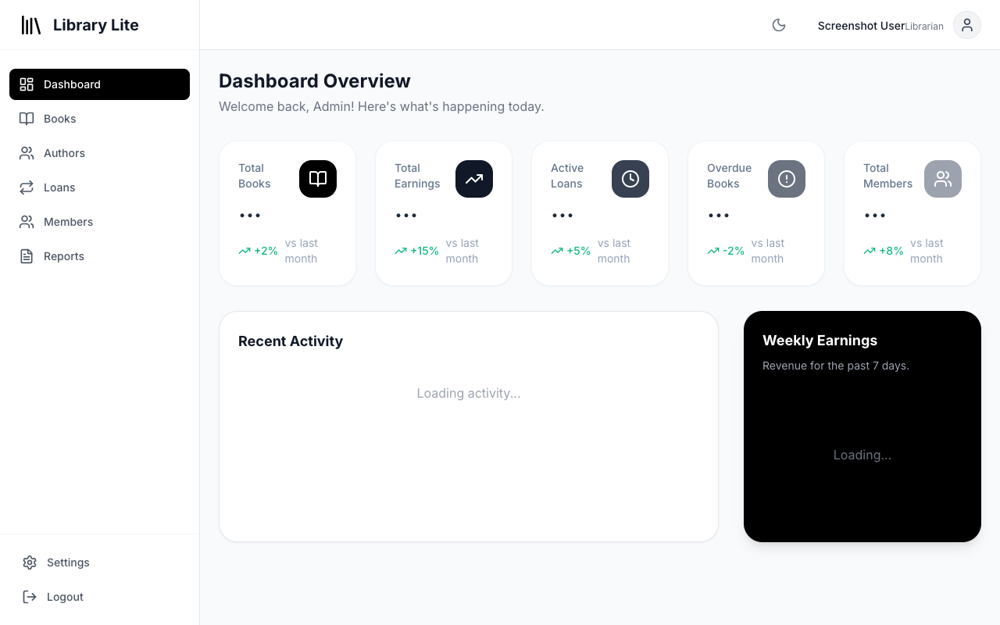
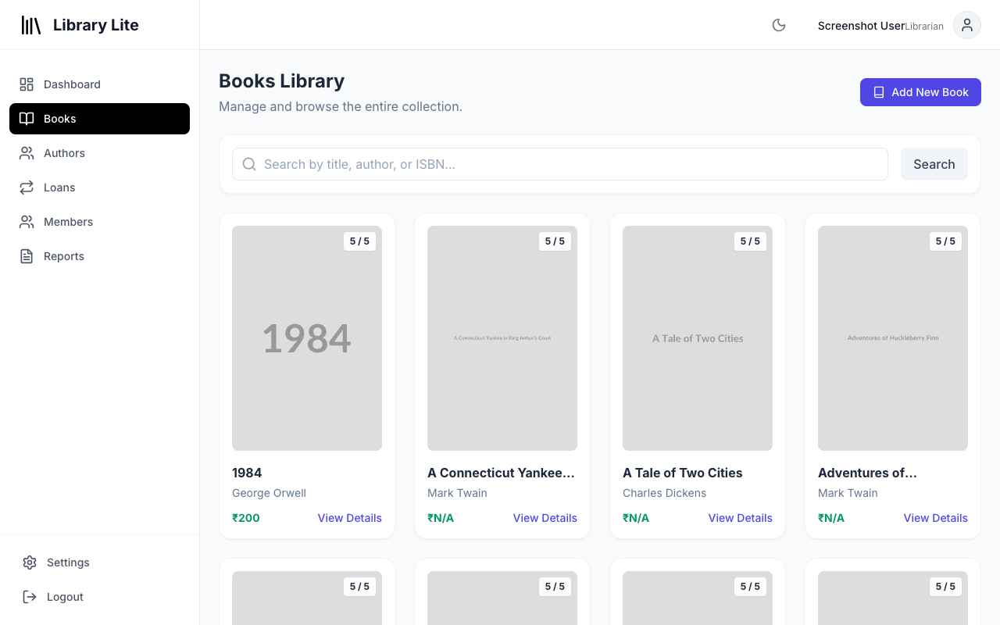
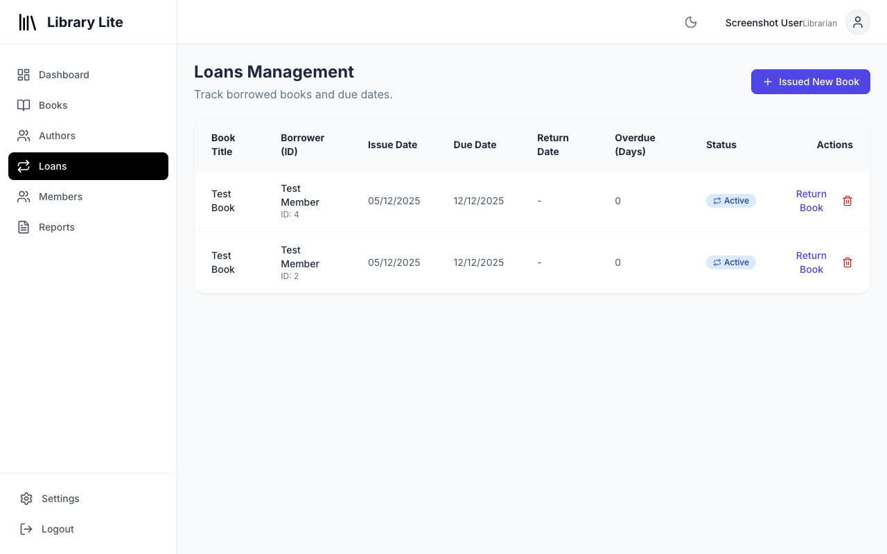

# Library_Lite

**Deployed Link:** [https://library-lite-1.onrender.com](https://library-lite-1.onrender.com)

Library_Lite is a modern, full-stack library management system designed to streamline the process of borrowing and managing books. It features a robust backend, a responsive frontend, and seamless authentication.

## ✨ Features

*   **User Authentication:** Secure signup and login for users and admins.
*   **GitHub OAuth:** Easy one-click login using GitHub.
*   **Dashboard:** Comprehensive dashboard for admins to view stats like total books, active loans, overdue loans, and earnings.
*   **Book Management:** Add, update, delete, and search for books.
*   **Author Management:** Manage author profiles and their associated books.
*   **Loan System:** Issue books to members, track due dates, and manage returns.
*   **Fine Calculation:** Automatic calculation of fines for overdue books.
*   **Member Management:** Manage library members and their membership details.
*   **Responsive Design:** Works seamlessly on desktops, tablets, and mobile devices.
*   **Dark Mode:** Built-in dark mode for better readability.

## 📸 Screenshots

*(Please add screenshots here)*

### Dashboard


### Book List


### Loan Management


## 🚀 Tutorial & Usage

### 1. Getting Started
*   **Sign Up/Login:** Create an account or log in using your GitHub credentials.
*   **Admin Access:** The first user is typically the admin, or specific credentials are used for admin access.

### 2. Managing Books
*   Navigate to the **Books** section.
*   Click **"Add Book"** to add a new title.
*   Use the **Search** bar to find specific books by title, author, or ISBN.
*   Click on a book to view details, edit, or delete it.

### 3. Issuing Loans
*   Go to the **Loans** section.
*   Click **"Issue Loan"**.
*   Select the **Member** and the **Book**.
*   The due date is automatically set (default is 7 days).
*   Click **"Issue"** to confirm.

### 4. Returning Books
*   In the **Loans** section, find the active loan.
*   Click **"Return"**.
*   If the book is overdue, the system will display the calculated fine.
*   Confirm the return to update the book's availability.

### 5. Managing Members
*   Navigate to the **Members** section.
*   View a list of all registered members.
*   You can view their loan history and membership status.

## 🛠️ Tech Stack

*   **Frontend:** React, Vite, Tailwind CSS
*   **Backend:** Node.js, Express.js
*   **Database:** PostgreSQL (hosted on Neon)
*   **ORM:** Prisma
*   **Authentication:** Passport.js, JWT
*   **Deployment:** Render

## 📦 Installation (Local Development)

1.  Clone the repository:
    ```bash
    git clone https://github.com/lomesh2312/Library_Lite.git
    ```
2.  Install Backend Dependencies:
    ```bash
    cd backend
    npm install
    ```
3.  Install Frontend Dependencies:
    ```bash
    cd ../frontend
    npm install
    ```
4.  Set up Environment Variables:
    *   Create `.env` in `backend` and `frontend` directories with necessary keys.
5.  Run the App:
    *   Backend: `npm start`
    *   Frontend: `npm run dev`

---
*Built with ❤️ by [Your Name]*
